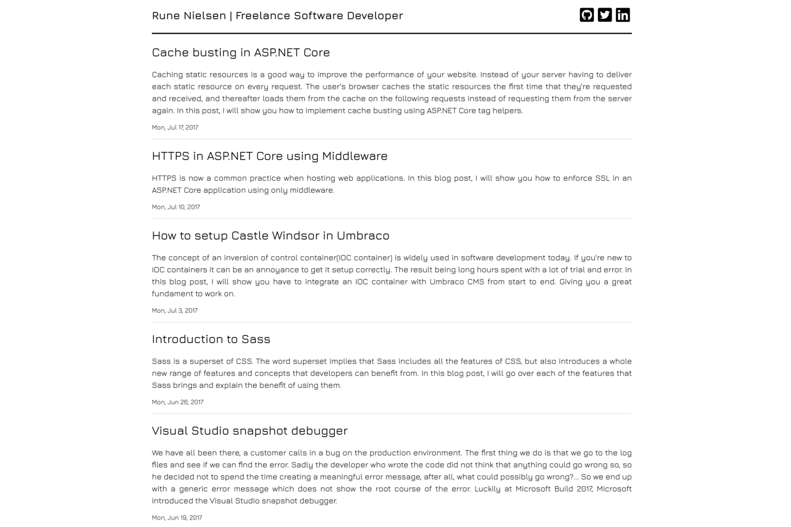

# Modest theme for Hugo

Modest is a simple responsive blog theme for the Hugo static site generator.

## Showcase



## Install

``` sh
git clone https://github.com/runeanielsen/modest themes/modest
```

**Important**: Take a look inside the exampleSite folder of this theme. You'll find a file called config.toml. To use it, copy the config.toml in the root folder of your Hugo site. Feel free to change it.

## Development

To run the project, cd into `./exampleSite` and start the hugo server.

```sh
hugo server -t ../..
```

## License

Licensed under the MIT license.
