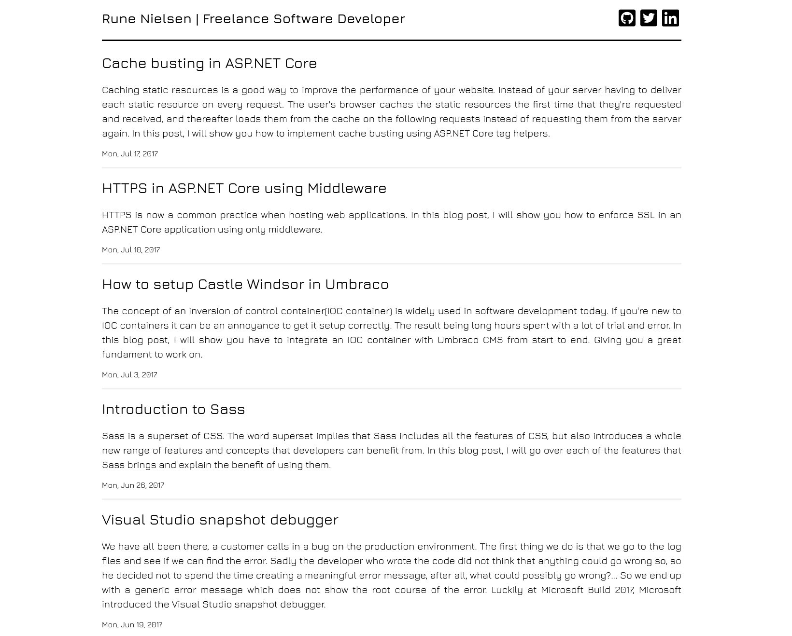
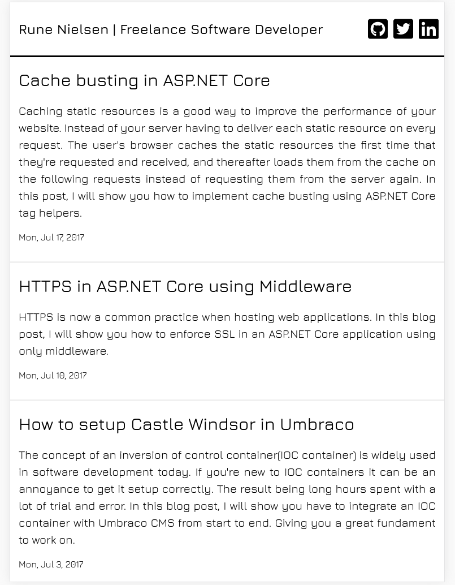
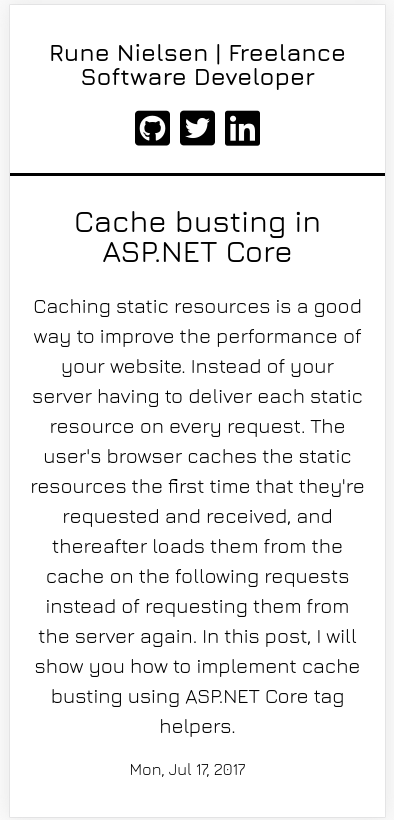

# Modest theme for Hugo

[](https://github.com/runeanielsen/modest/blob/master/LICENSE)

Modest is a simple responsive blog theme for the Hugo static site generator.

## Showcase

### Desktop



### Tablet



### Mobile



## Install

``` sh
git clone https://github.com/runeanielsen/modest themes/modest
```

**Important**: Take a look inside the exampleSite folder of this theme. You'll find a file called config.toml. To use it, copy the config.toml in the root folder of your Hugo site. Feel free to change it.

## License

Licensed under the MIT license.
